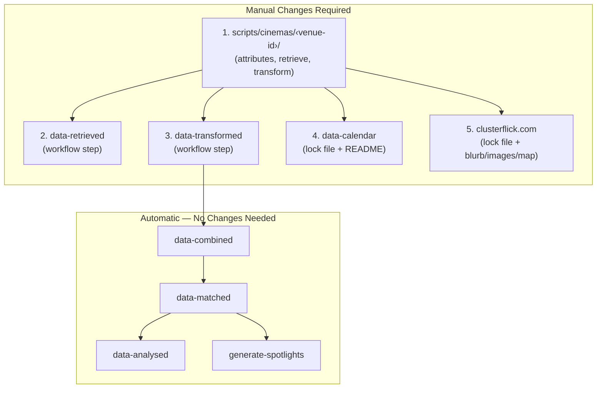

# Adding a Venue

This guide covers the end-to-end process of adding a new venue to Clusterflick.
A new venue requires changes across four repositories and touches a fifth
(`scripts`) where the core logic lives.

## Overview



| Repository         | What to Change                           | Why                                                                          |
| ------------------ | ---------------------------------------- | ---------------------------------------------------------------------------- |
| `scripts`          | Create venue directory (2–4 files)       | Core venue definition, retrieval, and transformation logic                   |
| `data-retrieved`   | Add step to workflow YAML                | Include the venue in the daily retrieval run                                 |
| `data-transformed` | Add step to workflow YAML                | Include the venue in the daily transformation run                            |
| `data-calendar`    | `npm update scripts` + add row to README | Lock file pins a specific `scripts` commit; README lists all venue calendars |
| `clusterflick.com` | `npm update scripts` + blurb/images/map  | Lock file pins a specific `scripts` commit; venue page auto-generates        |

`data-retrieved` and `data-transformed` have no lock file — they always pull the
latest `scripts` on install. `data-calendar` and `clusterflick.com` both have a
`package-lock.json`, so the dependency must be explicitly updated.

---

## Step 1: Create the Venue Definition

Create a new directory at `scripts/cinemas/<venue-id>/`.

The venue ID follows the convention `domain` or `domain-location` (e.g.
`phoenixcinema.co.uk`, `odeon.co.uk-leicester-square`).

Venues that scrape their own website need four files: `attributes.js`,
`index.js`, `retrieve.js`, and `transform.js`. Source-only venues (those with no
website to scrape that rely entirely on external ticketing platforms) need only
two files: `attributes.js` and `index.js`.

### `attributes.js`

Venue metadata used throughout the pipeline.

| Field              | Required | Description                                                    |
| ------------------ | -------- | -------------------------------------------------------------- |
| `id`               | Yes      | Unique identifier matching the directory name                  |
| `name`             | Yes      | Human-readable display name                                    |
| `domain`           | Yes      | Base website URL                                               |
| `url`              | Yes      | Direct link to the venue's cinema/screenings page              |
| `address`          | Yes      | Full address (comma-separated)                                 |
| `geo`              | Yes      | `{ lat, lon }` coordinates                                     |
| `structure`        | Yes      | `"solo"` or `"group"`                                          |
| `type`             | Yes      | Venue type (e.g. `"Cinema"`, `"Museum"`, `"Community Centre"`) |
| `socials`          | Yes      | `{ letterboxd, twitter, instagram }` (values can be `null`)    |
| `groupName`        | If group | Parent chain name (e.g. `"Odeon"`, `"Everyman"`)               |
| `alternativeNames` | No       | Array of alternative names for matching                        |

Additional venue-specific fields (e.g. `cinemaId`, `siteId`) can be added as
needed by the retrieval and transformation logic.

**Solo venue example:**

```js
// cinemas/actonecinema.co.uk/attributes.js
module.exports = {
  id: "actonecinema.co.uk",
  name: "ActOne Cinema",
  alternativeNames: ["ActOne Cinema & Café"],
  domain: "https://www.actonecinema.co.uk",
  socials: {
    letterboxd: null,
    twitter: "actone_cinema",
    instagram: "actone_cinema",
  },
  url: "https://www.actonecinema.co.uk",
  address: "The Old Library, 119-121 High Street, London, W3 6NA, UK",
  geo: { lat: 51.50659496972112, lon: -0.2685726176017849 },
  structure: "solo",
  type: "Cinema",
  siteId: "eyJfcmFpbHMiOns...",
};
```

**Group/chain venue example:**

```js
// cinemas/odeon.co.uk-leicester-square/attributes.js
module.exports = {
  id: "odeon.co.uk-leicester-square",
  name: "ODEON Luxe Leicester Square",
  domain: "https://www.odeon.co.uk",
  socials: {
    letterboxd: "odeoncinemas",
    twitter: "ODEONCinemas",
    instagram: "odeoncinemas",
  },
  url: "https://www.odeon.co.uk/cinemas/london-leicester-square",
  address: "24-26 Leicester Square, London, WC2H 7JY, UK",
  geo: { lat: 51.51053736313127, lon: -0.12932277571696912 },
  structure: "group",
  groupName: "Odeon",
  type: "Cinema",
  cinemaId: "153",
};
```

### `index.js`

Standard boilerplate that exports the module interface. This is the same for
every venue:

```js
// cinemas/<venue-id>/index.js
const attributes = require("./attributes");
const retrieve = require("./retrieve");
const transform = require("./transform");

module.exports = {
  attributes,
  retrieve,
  transform,
};
```

For source-only venues (see below), the imports point to shared modules instead:

```js
// cinemas/<venue-id>/index.js
const attributes = require("./attributes");
const retrieve = require("../../common/source-only/retrieve");
const transform = require("../../common/source-only/transform");

module.exports = {
  attributes,
  retrieve,
  transform,
};
```

### `retrieve.js`

Fetches raw data from the venue's website or API. Most venues delegate to a
shared platform module in `common/`:

```js
// cinemas/odeon.co.uk-leicester-square/retrieve.js
const attributes = require("./attributes");
const odeonRetrieve = require("../../common/odeon.co.uk/retrieve");

async function retrieve() {
  return odeonRetrieve(attributes);
}

module.exports = retrieve;
```

If the venue doesn't have its own website and relies entirely on external
ticketing platforms (Eventbrite, Dice, etc.), skip this file — source-only
venues don't need a local `retrieve.js`. The `index.js` imports the shared
`common/source-only/retrieve` module directly (see above).

For standalone venues that need custom scraping, see the
[retrieve pipeline documentation](./retrieve.md) for available approaches and
utilities.

### `transform.js`

Converts raw data into the standardised schema. Like retrieve, most venues
delegate to a shared module:

```js
// cinemas/odeon.co.uk-leicester-square/transform.js
const attributes = require("./attributes");
const odeonTransform = require("../../common/odeon.co.uk/transform");

async function transform(data, sourcedEvents) {
  return odeonTransform(attributes, data, sourcedEvents);
}

module.exports = transform;
```

The `sourcedEvents` parameter contains events found by external ticketing
platforms (Eventbrite, Dice, etc.) at the venue's location. Source-only venues
don't need a local `transform.js` — the `index.js` imports the shared
`common/source-only/transform` module directly (see above).

See the [transform pipeline documentation](./transform.md) for the full
standardised schema and matching process.

### Add to the `optedIn` List

**File:** `scripts/scripts/transform/index.js`

The transform pipeline has an `optedIn` array that controls which venues get
"missing data" recovery. When a venue is opted in, the pipeline checks if movies
from the previous release have disappeared and, if their listing pages are still
live, adds them back into the output. This prevents movies from temporarily
dropping off when a venue's website has a transient issue.

Add the new venue ID to the `optedIn` array in alphabetical order.

---

## Step 2: Add to `data-retrieved` Workflow

**File:** `data-retrieved/.github/workflows/retrieve.yml`

Add a new step to the appropriate job group. Each job group has setup steps
(checkout, node, npm install, optionally Playwright) followed by venue steps.

### Choosing a Job Group

| Criterion                                     | Job Group Type                                      |
| --------------------------------------------- | --------------------------------------------------- |
| Venue belongs to an existing chain            | Add to the chain's existing job group               |
| Needs Playwright (browser automation)         | Job group with `npx playwright install --with-deps` |
| Lightweight (simple HTTP/JSON, no browser)    | `ubuntu-latest` runner, no Playwright               |
| Demanding (heavy scraping, network-intensive) | `self-hosted` runner                                |

### Adding the Step

Add the venue step before the "Upload Artifacts" step in the chosen job group:

```yaml
- name: <venue-id>
  uses: nick-fields/retry@v3
  with:
    timeout_minutes: 20
    max_attempts: 3
    command: npx clusterflick/scripts retrieve <venue-id>
```

Adjust `timeout_minutes` and `max_attempts` based on the venue's reliability.
Standard values are 20 minutes and 3 attempts. For less reliable venues,
increase as needed.

For source-only venues (no website to scrape), a simpler step without retry is
sufficient:

```yaml
- name: <venue-id>
  run: npx clusterflick/scripts retrieve <venue-id>
```

### Creating a New Job Group

If the venue doesn't fit an existing group, create a new job group. Use this
template:

```yaml
# ------------------------------------------------------------------------------
# Retrieve <Group Name>
# ------------------------------------------------------------------------------
retrieve_<group_name>:
  name: Retrieve <Group Name>
  runs-on: ubuntu-latest
  steps:
    - uses: actions/checkout@v4
    - uses: actions/setup-node@v4
      with:
        node-version-file: .node-version
    - run: npm install

    - name: <venue-id>
      uses: nick-fields/retry@v3
      with:
        timeout_minutes: 20
        max_attempts: 3
        command: npx clusterflick/scripts retrieve <venue-id>

    - name: Upload Artifacts
      uses: actions/upload-artifact@v4
      with:
        name: retrieve_<group_name>
        path: retrieved-data/
```

If the venue needs Playwright, add the setup steps before the venue steps:

```yaml
- name: Set Playwright path
  run:
    echo "PLAYWRIGHT_BROWSERS_PATH=$HOME/.cache/playwright-browsers" >>
    $GITHUB_ENV
# ... (after npm install)
- run: npx playwright install --with-deps
```

If using a self-hosted runner, add the Playwright failure artifact upload at the
end:

```yaml
- name: Save test failure artifacts
  if: failure()
  uses: actions/upload-artifact@v4
  with:
    name: retrieve_<group_name>-playwright-failures
    path: ./playwright-failures
```

When creating a new job group, also add it to the `create_release` job's `needs`
array so the release waits for it to complete.

---

## Step 3: Add to `data-transformed` Workflow

**File:** `data-transformed/.github/workflows/transform.yml`

Add a new step to the matching job group. Chain venues should go in the
corresponding transform group — if the venue is in the BFI retrieve group, add
it to the BFI transform group. Source-only venues go in one of the
`transform_external_events_*` groups (corresponding to the
`retrieve_source_only_*` groups in the retrieve workflow).

```yaml
- name: <venue-id>
  run: npx clusterflick/scripts transform <venue-id>
```

Transform steps don't use the retry wrapper since they operate on local data.

If you created a new job group in `data-retrieved`, create a corresponding one
here. Transform job groups need additional setup for API keys, caching, and data
downloads:

```yaml
# ------------------------------------------------------------------------------
# Transform <Group Name>
# ------------------------------------------------------------------------------
transform_<group_name>:
  name: Transform <Group Name>
  needs: [download_retrieved_data, download_historical_data]
  runs-on: ubuntu-latest
  env:
    TZ: Europe/London
    MOVIEDB_API_KEY: ${{ secrets.MOVIEDB_API_KEY }}
    GEMINI_API_KEY: ${{ secrets.GEMINI_API_KEY }}
    PAT: ${{ secrets.PAT }}
  steps:
    - uses: actions/checkout@v3
    - uses: actions/setup-node@v3
      with:
        node-version-file: .node-version
    - run: npm install
    - name: Set cache date
      run: echo "CACHE_DATE=$(date +'%Y-%m-%d')" >> $GITHUB_ENV
    - name: Cache LLM responses
      uses: actions/cache@v3
      with:
        path: cache-llm
        key: cache-llm-${{ github.job }}-${{ env.CACHE_DATE }}
    - name: Download Retrieved Data
      uses: actions/download-artifact@v4
      with:
        name: retrieved-data
        path: retrieved-data/
    - name: Download Historical Data
      uses: actions/download-artifact@v4
      with:
        name: combined-data
        path: combined-data/

    - name: <venue-id>
      run: npx clusterflick/scripts transform <venue-id>

    - name: Upload Artifacts
      uses: actions/upload-artifact@v4
      with:
        name: transform_<group_name>
        path: transformed-data/
```

When creating a new job group, also add it to the `create_release` job's `needs`
array.

---

## Step 4: Update `data-calendar`

**Two changes needed.**

### Update the Lock File

`data-calendar` has a `package-lock.json` that pins the `scripts` dependency to
a specific commit. After the `scripts` changes are merged, update the lock:

```bash
cd data-calendar
npm update scripts
```

This ensures the calendar generation picks up the new venue's attributes.

### Add to the README

`data-calendar/README.md` contains a table of all supported venues with links to
their calendar files. Add a row in alphabetical order by venue name and update
the venue count above the table:

```markdown
| <Venue Name> |
[`<venue-id>`](https://github.com/clusterflick/data-calendar/releases/latest/download/<venue-id>)
|
```

---

## Step 5: Update `clusterflick.com`

**Four changes needed.** The lock file update and image generation require the
`scripts` changes to be merged first (see [Post-Merge Steps](#post-merge-steps)
below). The blurb can be created at any time.

### Custom Blurb

Create a component at `src/components/venues/<venue-id>.tsx` to provide a custom
description for the venue page. Without this, the page falls back to an
auto-generated description.

```tsx
// src/components/venues/<venue-id>.tsx
function VenueBlurb() {
  return (
    <section>
      <p>A short description of the venue...</p>
      <p>What makes it special, its programme, community, etc.</p>
    </section>
  );
}

export const seoDescription = "short tagline for search engines";
export const seoHighlights = "key genres or features";

export default VenueBlurb;
```

### Update the Lock File

`clusterflick.com` has a `package-lock.json` that pins the `scripts` dependency.
After the `scripts` changes are merged:

```bash
cd clusterflick.com
npm update scripts
```

The venue page at `/venues/<slugified-name>` will auto-generate at build time
from the venue's attributes and transformed data. No additional configuration is
needed for the page to appear.

### Venue Images

A script at `clusterflick.com/scripts/fetch-venue-images.js` fetches logo/icon
images for venues. Existing images are skipped, so running it after adding a new
venue will only fetch the new one:

```bash
cd clusterflick.com
node scripts/fetch-venue-images.js
```

### Map Image

A script at `clusterflick.com/scripts/fetch-venue-maps.js` generates map images
for all venues using the Google Maps Static API. It reads coordinates from each
venue's `attributes.js`, fetches a dark-themed map tile, and saves it to
`public/images/venues/maps/<venue-id>.png`. Existing images are skipped, so
running it after adding a new venue will only fetch the new one:

```bash
cd clusterflick.com
node scripts/fetch-venue-maps.js
```

Requires a `GOOGLE_MAPS_API_KEY` in `.env`.

---

## Post-Merge Steps

Steps 4 and 5 include lock file updates (`npm update scripts`) and image
generation that can only run after the `scripts` changes are merged. These steps
are easy to forget because they happen later in a separate session.

**If you are an LLM completing the earlier steps**, report the following as
remaining next steps for the user:

1. After `scripts` is merged, run `npm update scripts` in both `data-calendar`
   and `clusterflick.com`
2. Run `node scripts/fetch-venue-images.js` in `clusterflick.com`
3. Run `node scripts/fetch-venue-maps.js` in `clusterflick.com` (requires
   `GOOGLE_MAPS_API_KEY`)

---

## Verification

### Local Testing

From the `scripts` directory, test retrieval and transformation:

```bash
npm run retrieve <venue-id>
npm run transform <venue-id>
```

The transform step will validate the output against `schema.json` and report any
errors.

### End-to-End

After merging all changes:

1. Trigger the `data-retrieved` workflow (or wait for the daily 3am UTC run)
2. Verify the venue appears in the `data-retrieved` release artifacts
3. Confirm the `data-transformed` workflow picks it up and produces valid output
4. Check the venue page generates at `clusterflick.com/venues/<slugified-name>`
5. Verify the calendar feed is accessible at the `data-calendar` release URL
