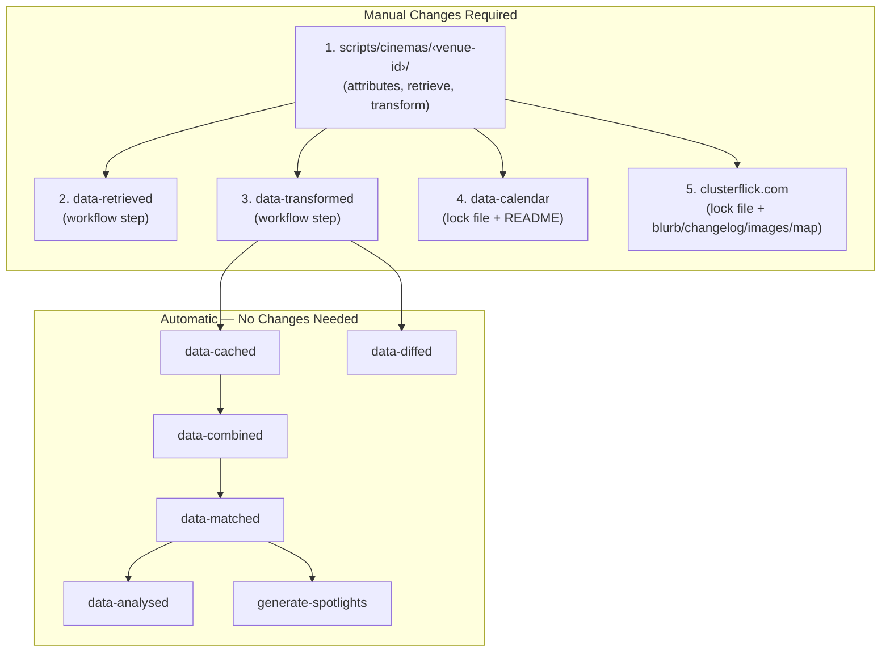

# Adding a Venue

This guide covers the end-to-end process of adding a new venue to Clusterflick.
A new venue requires changes across four repositories and touches a fifth
(`scripts`) where the core logic lives.

## Overview



| Repository         | What to Change                                    | Why                                                                          |
| ------------------ | ------------------------------------------------- | ---------------------------------------------------------------------------- |
| `scripts`          | Create venue directory (2–4 files)                | Core venue definition, retrieval, and transformation logic                   |
| `data-retrieved`   | Add step to workflow YAML                         | Include the venue in the daily retrieval run                                 |
| `data-transformed` | Add step to workflow YAML                         | Include the venue in the daily transformation run                            |
| `data-calendar`    | `npm update scripts` + add row to README          | Lock file pins a specific `scripts` commit; README lists all venue calendars |
| `clusterflick.com` | `npm update scripts` + blurb/changelog/images/map | Lock file pins a specific `scripts` commit; venue page auto-generates        |

`data-retrieved` and `data-transformed` have no lock file — they always pull the
latest `scripts` on install. `data-calendar` and `clusterflick.com` both have a
`package-lock.json`, so the dependency must be explicitly updated.

---

## Step 1: Create the Venue Definition

Create a new directory at `scripts/cinemas/<venue-id>/`.

The venue ID follows the convention `domain` or `domain-location` (e.g.
`phoenixcinema.co.uk`, `odeon.co.uk-leicester-square`).

Venues that scrape their own website need four files: `attributes.js`,
`index.js`, `retrieve.js`, and `transform.js`. Source-only venues (those with no
website to scrape that rely entirely on external ticketing platforms) need only
two files: `attributes.js` and `index.js`.

Cinema modules are discovered by scanning the `cinemas/` directory
(`cinemas/index.js`), so there is no registry to add the venue to.

### Source-Only or Own Retriever?

The deciding question is not "does the venue have a website?" but **"can the
site give a film title, date and time for each screening?"** Plenty of
source-only venues have perfectly good websites with an events page — they are
source-only because the listings there aren't usable as film data.

Signs a venue should be source-only even though it has a site:

- Screenings are advertised under a series name only ("Family Film Fridays",
  "Sunday Matinee") without naming the films
- The programme lives on the venue's social media rather than the site
- Booking links point straight at a ticketing platform already covered by
  `sources/` — the source retriever will pick the screenings up with richer data

Writing a retriever that emits untitled screenings is worse than not having one:
it produces showings the pipeline can't match to TMDB, and it violates the
"never invent data" rule to fill in the gaps.

### `attributes.js`

Venue metadata used throughout the pipeline.

| Field              | Required | Description                                                    |
| ------------------ | -------- | -------------------------------------------------------------- |
| `id`               | Yes      | Unique identifier matching the directory name                  |
| `name`             | Yes      | Human-readable display name                                    |
| `domain`           | Yes      | Base website URL                                               |
| `url`              | Yes      | Direct link to the venue's cinema/screenings page              |
| `address`          | Yes      | Full address (comma-separated)                                 |
| `geo`              | Yes      | `{ lat, lon }` coordinates                                     |
| `structure`        | Yes      | `"solo"` or `"group"`                                          |
| `type`             | Yes      | Venue type (e.g. `"Cinema"`, `"Museum"`, `"Community Centre"`) |
| `socials`          | Yes      | `{ letterboxd, twitter, instagram }` (values can be `null`)    |
| `groupName`        | If group | Parent chain name (e.g. `"Odeon"`, `"Everyman"`)               |
| `alternativeNames` | No       | Array of alternative names for matching                        |

Additional venue-specific fields (e.g. `cinemaId`, `siteId`) can be added as
needed by the retrieval and transformation logic.

**`name` and `alternativeNames` decide whether sources find the venue.** Sources
match an event's venue to a cinema with `findMatchingCinema`
(`common/source-utils.js`): the names must be equal once normalised, _and_ the
coordinates must be within 0.35km (with a postcode fallback). Normalisation
(`common/normalize-name.js`) lowercases, drops a leading `the`, strips
punctuation — including `&` — and removes all whitespace. So `The Foo & Bar`,
`Foo & Bar` and `Foo&Bar` all collapse to `foobar`, but `Foo and Bar` does not.
Add the spelled-out variant to `alternativeNames` whenever a venue's name
contains an ampersand, and check how the ticketing platforms actually spell it.

**Solo venue example:**

```js
// cinemas/actonecinema.co.uk/attributes.js
module.exports = {
  id: "actonecinema.co.uk",
  name: "ActOne Cinema",
  alternativeNames: ["ActOne Cinema & Café"],
  domain: "https://www.actonecinema.co.uk",
  socials: {
    letterboxd: null,
    twitter: "actone_cinema",
    instagram: "actone_cinema",
  },
  url: "https://www.actonecinema.co.uk",
  address: "The Old Library, 119-121 High Street, London, W3 6NA, UK",
  geo: { lat: 51.50659496972112, lon: -0.2685726176017849 },
  structure: "solo",
  type: "Cinema",
  siteId: "eyJfcmFpbHMiOns...",
};
```

**Group/chain venue example:**

```js
// cinemas/odeon.co.uk-leicester-square/attributes.js
module.exports = {
  id: "odeon.co.uk-leicester-square",
  name: "ODEON Luxe Leicester Square",
  domain: "https://www.odeon.co.uk",
  socials: {
    letterboxd: "odeoncinemas",
    twitter: "ODEONCinemas",
    instagram: "odeoncinemas",
  },
  url: "https://www.odeon.co.uk/cinemas/london-leicester-square",
  address: "24-26 Leicester Square, London, WC2H 7JY, UK",
  geo: { lat: 51.51053736313127, lon: -0.12932277571696912 },
  structure: "group",
  groupName: "Odeon",
  type: "Cinema",
  cinemaId: "153",
};
```

### `index.js`

Standard boilerplate that exports the module interface. This is the same for
every venue:

```js
// cinemas/<venue-id>/index.js
const attributes = require("./attributes");
const retrieve = require("./retrieve");
const transform = require("./transform");

module.exports = {
  attributes,
  retrieve,
  transform,
};
```

For source-only venues (see below), the imports point to shared modules instead:

```js
// cinemas/<venue-id>/index.js
const attributes = require("./attributes");
const retrieve = require("../../common/source-only/retrieve");
const transform = require("../../common/source-only/transform");

module.exports = {
  attributes,
  retrieve,
  transform,
};
```

### `retrieve.js`

Fetches raw data from the venue's website or API. Most venues delegate to a
shared platform module in `common/`:

```js
// cinemas/odeon.co.uk-leicester-square/retrieve.js
const attributes = require("./attributes");
const odeonRetrieve = require("../../common/odeon.co.uk/retrieve");

async function retrieve() {
  return odeonRetrieve(attributes);
}

module.exports = retrieve;
```

If the venue doesn't have its own website and relies entirely on external
ticketing platforms (Eventbrite, Dice, etc.), skip this file — source-only
venues don't need a local `retrieve.js`. The `index.js` imports the shared
`common/source-only/retrieve` module directly (see above).

For standalone venues that need custom scraping, see the
[retrieve pipeline documentation](./retrieve.md) for available approaches and
utilities.

### `transform.js`

Converts raw data into the standardised schema. Like retrieve, most venues
delegate to a shared module:

```js
// cinemas/odeon.co.uk-leicester-square/transform.js
const attributes = require("./attributes");
const odeonTransform = require("../../common/odeon.co.uk/transform");

async function transform(data, sourcedEvents) {
  return odeonTransform(attributes, data, sourcedEvents);
}

module.exports = transform;
```

The `sourcedEvents` parameter contains events found by external ticketing
platforms (Eventbrite, Dice, etc.) at the venue's location. Source-only venues
don't need a local `transform.js` — the `index.js` imports the shared
`common/source-only/transform` module directly (see above).

See the [transform pipeline documentation](./transform.md) for the full
standardised schema and matching process.

---

## Step 2: Add to `data-retrieved` Workflow

**File:** `data-retrieved/.github/workflows/retrieve.yml`

Add a new step to the appropriate job group. Every job group starts with the
shared composite setup action and ends with an artifact upload; venue steps go
in between.

```yaml
- uses: clusterflick/.github/setup@main
```

That single step handles checkout, Node, and installing dependencies (including
refreshing `scripts` to the latest commit). Pass `playwright: true` when the
group needs a browser.

### Choosing a Job Group

| What you're adding                                | Retrieve job group             | Transform job group              |
| ------------------------------------------------- | ------------------------------ | -------------------------------- |
| Source (ticketing platform)                       | `retrieve_sources`             | N/A (sources aren't transformed) |
| Source-only venue (no website, relies on sources) | `retrieve_source_only_*`       | `transform_external_events_*`    |
| Venue belonging to an existing chain              | The chain's existing job group | The chain's existing job group   |
| Standalone venue with its own retriever           | `retrieve_remaining_cinemas_*` | `transform_remaining_*`          |

For numbered groups, add to the **smallest** group rather than the last one —
they are split to keep job runtimes even, and appending always to the end lets
the tail group drift well past the others. Count the steps per group before
choosing:

```bash
awk '/^  retrieve_/{g=$1} /npm run retrieve --/{c[g]++} END{for(k in c) print c[k], k}' \
  .github/workflows/retrieve.yml | sort -n
```

The numbered retrieve and transform groups are **not** paired one-to-one — there
are more `transform_external_events_*` groups than `retrieve_source_only_*`
ones — so pick the smallest group on each side independently.

**Playwright dependency:** Check whether the venue's retriever uses Playwright
(browser automation). If it does, it must go in a group whose setup step passes
`playwright: true`. The `retrieve_remaining_cinemas_*` groups (which run on
`self-hosted`) and most chain groups have it; the `retrieve_source_only_*`
groups do not.

### Adding the Step

Add the venue step at the end of the chosen job group, before the "Upload
Artifacts" step:

```yaml
- name: <venue-id>
  uses: nick-fields/retry@v4
  with:
    timeout_minutes: 20
    max_attempts: 3
    command: npm run retrieve -- <venue-id>
```

Note the `--` separating the npm script from its argument, and that the venue
runs through the repo's own npm script rather than `npx`.

Venues and sources that make network calls during retrieve should use the retry
wrapper since network requests can fail intermittently. Standard values are 20
minutes timeout and 3 attempts.

Source-only venues don't make network calls (their retrieve returns `{}`), so a
simpler step without retry is sufficient:

```yaml
- name: <venue-id>
  run: npm run retrieve -- <venue-id>
```

### Creating a New Job Group

If the venue doesn't fit an existing group, create a new job group. Use this
template:

```yaml
# ------------------------------------------------------------------------------
# Retrieve <Group Name>
# ------------------------------------------------------------------------------
retrieve_<group_name>:
  name: Retrieve <Group Name>
  runs-on: ubuntu-latest
  steps:
    - uses: clusterflick/.github/setup@main

    - name: <venue-id>
      uses: nick-fields/retry@v4
      with:
        timeout_minutes: 20
        max_attempts: 3
        command: npm run retrieve -- <venue-id>

    - name: Upload Artifacts
      uses: actions/upload-artifact@v7
      with:
        name: retrieve_<group_name>
        path: retrieved-data/
```

If the venue needs Playwright, ask the setup action for it — there is no
separate install step:

```yaml
- uses: clusterflick/.github/setup@main
  with:
    playwright: true
```

Playwright groups also upload their failure artifacts at the end of the job:

```yaml
- name: Save test failure artifacts
  if: failure()
  uses: actions/upload-artifact@v7
  with:
    name: retrieve_<group_name>-playwright-failures
    path: ./playwright-failures
```

When creating a new job group, also add it to the `create_release` job's `needs`
array so the release waits for it to complete.

---

## Step 3: Add to `data-transformed` Workflow

**File:** `data-transformed/.github/workflows/transform.yml`

Add a new step to the matching job group. Chain venues should go in the
corresponding transform group — if the venue is in the BFI retrieve group, add
it to the BFI transform group. Source-only venues go in the smallest
`transform_external_events_*` group; these don't line up one-to-one with the
`retrieve_source_only_*` groups, so choose by size rather than by number.

```yaml
- name: <venue-id>
  run: npm run transform -- <venue-id>
```

Transform steps don't use the retry wrapper since they operate on local data.

If you created a new job group in `data-retrieved`, create a corresponding one
here. Transform job groups need additional setup for API keys, caching, and data
downloads:

```yaml
# ------------------------------------------------------------------------------
# Transform <Group Name>
# ------------------------------------------------------------------------------
transform_<group_name>:
  name: Transform <Group Name>
  needs: [download_retrieved_data, download_historical_data]
  runs-on: ubuntu-latest
  env:
    TZ: Europe/London
    MOVIEDB_API_KEY: ${{ secrets.MOVIEDB_API_KEY }}
    GEMINI_API_KEY: ${{ secrets.GEMINI_API_KEY }}
    PAT: ${{ secrets.PAT }}
  steps:
    - uses: clusterflick/.github/setup@main
    - name: Set cache date
      run: echo "CACHE_DATE=$(date +'%Y-%m-%d')" >> $GITHUB_ENV
    - name: Cache LLM responses
      uses: actions/cache@v5
      with:
        path: cache-llm
        key: cache-llm-${{ github.job }}-${{ env.CACHE_DATE }}
    - name: Download Retrieved Data
      uses: actions/download-artifact@v8
      with:
        name: retrieved-data
        path: retrieved-data/
        github-token: ${{ github.token }}
    - name: Download Historical Data
      uses: actions/download-artifact@v8
      with:
        name: combined-data
        path: combined-data/
        github-token: ${{ github.token }}

    - name: <venue-id>
      run: npm run transform -- <venue-id>

    - name: Upload Artifacts
      uses: actions/upload-artifact@v7
      with:
        name: transform_<group_name>
        path: transformed-data/
```

`github-token` on the downloads is not optional — without it the action uses the
internal artifact service, which intermittently 404s on re-run attempts.

When creating a new job group, also add it to the `create_release` job's `needs`
array.

---

## Step 4: Update `data-calendar`

**Two changes needed** — one now, one after `scripts` is merged.

### Add to the README _(do now)_

`data-calendar/README.md` contains a table of all supported venues with links to
their calendar files. Add a row in alphabetical order by venue name and update
the "There are currently N supported venues" count above the table:

```markdown
| <Venue Name> |
[`<venue-id>`](https://github.com/clusterflick/data-calendar/releases/latest/download/<venue-id>)
|
```

Sort by the displayed venue name exactly as written, leading `The` included.
Every row is padded to the same width, so pad the new one to match its
neighbours — `npx prettier --check README.md` will catch it if you don't.

### Update the Lock File _(post-merge)_

`data-calendar` has a `package-lock.json` that pins the `scripts` dependency to
a specific commit. After the `scripts` changes are merged, update the lock:

```bash
cd data-calendar
npm update scripts
```

This ensures the calendar generation picks up the new venue's attributes.

---

## Step 5: Update `clusterflick.com`

**Five changes needed** — two now, three after `scripts` is merged.

### Custom Blurb _(do now)_

Create a component at `src/components/venues/<venue-id>.tsx` to provide a custom
description for the venue page. Without this, the page falls back to an
auto-generated description.

**Always research the venue before writing the blurb.** Fetch the venue's
website and read about their cinema programme before writing anything. Do not
write from general knowledge or make assumptions — only include what the venue
actually says about itself.

```tsx
// src/components/venues/<venue-id>.tsx
function VenueBlurb() {
  return (
    <section>
      <p>A short description of the venue...</p>
      <p>What makes it special, its programme, community, etc.</p>
    </section>
  );
}

export const seoDescription = "short tagline for search engines";
export const seoHighlights = "key genres or features";

export default VenueBlurb;
```

The venue page imports this dynamically by venue id, so there is nothing to
register. Run `npx prettier --write` and `npx eslint` on the new file before
committing — JSX needs `&amp;`, `&apos;` and friends, and the repo's lint gate
enforces it.

### Changelog Entry _(do now)_

`src/app/changelog/data.tsx` is a hand-maintained record of what's shipped,
newest day first. Add a `"New venue"` change to today's entry, creating the day
if it doesn't exist yet:

```tsx
{
  date: "YYYY-MM-DD",
  changes: [
    {
      tag: "New venue",
      body: ({ Venue }) => (
        <>
          Added <Venue name="<Venue Name>" url="<venue domain>" />, a one-line
          description of the place.
        </>
      ),
    },
  ],
},
```

Use the `Venue` helper rather than a hand-written link: it renders an internal
link to `/venues/<slugified-name>` once the venue is in the dataset and falls
back to the outbound URL until then, so a freshly added venue links somewhere
useful on the next build and upgrades itself later. `name` must match the
venue's `attributes.js` `name` exactly, since the helper slugifies it to find
the page. Use `VenueList` instead when adding several venues on the same day.

Within a day, the pink "new thing" tags come before `Improvement` and
`Under the hood`.

### Update the Lock File _(post-merge)_

`clusterflick.com` has a `package-lock.json` that pins the `scripts` dependency.
After the `scripts` changes are merged:

```bash
cd clusterflick.com
npm update scripts
```

The venue page at `/venues/<slugified-name>` will auto-generate at build time
from the venue's attributes and transformed data. No additional configuration is
needed for the page to appear.

### Venue Images _(post-merge)_

A script at `clusterflick.com/scripts/fetch-venue-images.js` fetches logo/icon
images for venues. Existing images are skipped, so running it after adding a new
venue will only fetch the new one:

```bash
cd clusterflick.com
node scripts/fetch-venue-images.js
```

### Map Image _(post-merge)_

A script at `clusterflick.com/scripts/fetch-venue-maps.js` generates map images
for all venues using the Google Maps Static API. It reads coordinates from each
venue's `attributes.js`, fetches a dark-themed map tile, and saves it to
`public/images/venues/maps/<venue-id>.png`. Existing images are skipped, so
running it after adding a new venue will only fetch the new one:

```bash
cd clusterflick.com
node scripts/fetch-venue-maps.js
```

Requires a `GOOGLE_MAPS_API_KEY` in `.env`.

---

## Post-Merge Steps

Steps 4 and 5 include lock file updates (`npm update scripts`) and image
generation that can only run after the `scripts` changes are merged. These steps
are easy to forget because they happen later in a separate session.

**If you are an LLM completing the earlier steps**, report the following as
remaining next steps for the user:

1. After `scripts` is merged, run `npm update scripts` in both `data-calendar`
   and `clusterflick.com`
2. Run `node scripts/fetch-venue-images.js` in `clusterflick.com`
3. Run `node scripts/fetch-venue-maps.js` in `clusterflick.com` (requires
   `GOOGLE_MAPS_API_KEY`)

---

## Verification

### Local Testing

From the `scripts` directory, test retrieval and transformation:

```bash
npm run retrieve <venue-id>
npm run transform <venue-id>
npm run lint
```

The transform step will validate the output against `schema.json` and report any
errors. Output lands in `transformed-data/<venue-id>` — read it, don't just
trust the exit code.

**For a source-only venue this is the real test of the attributes.** The
transform pulls in whatever the sources found for the venue, so a non-empty
result proves the name and coordinates match. To exercise it you need the
relevant source data in `retrieved-data/` — download a `data-retrieved` release,
or run `npm run retrieve <source-id>` for a source you expect to list the venue.
An empty result isn't necessarily wrong (the venue may simply have nothing on
sale), but it's worth confirming the venue is genuinely absent from the source
data rather than being missed by name matching.

Run `npx prettier --check` over every file you touched across the repos — all
five are Prettier-formatted, including the YAML workflows and the calendar
README.

### End-to-End

After merging all changes:

1. Trigger the `data-retrieved` workflow (or wait for the daily 3am UTC run)
2. Verify the venue appears in the `data-retrieved` release artifacts
3. Confirm the `data-transformed` workflow picks it up and produces valid output
4. Check the venue page generates at `clusterflick.com/venues/<slugified-name>`
5. Verify the calendar feed is accessible at the `data-calendar` release URL
