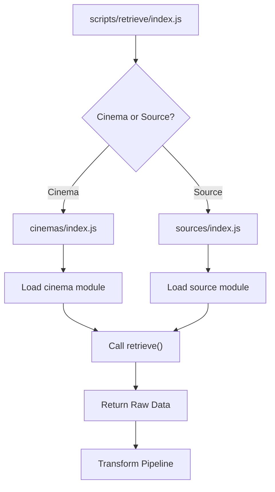
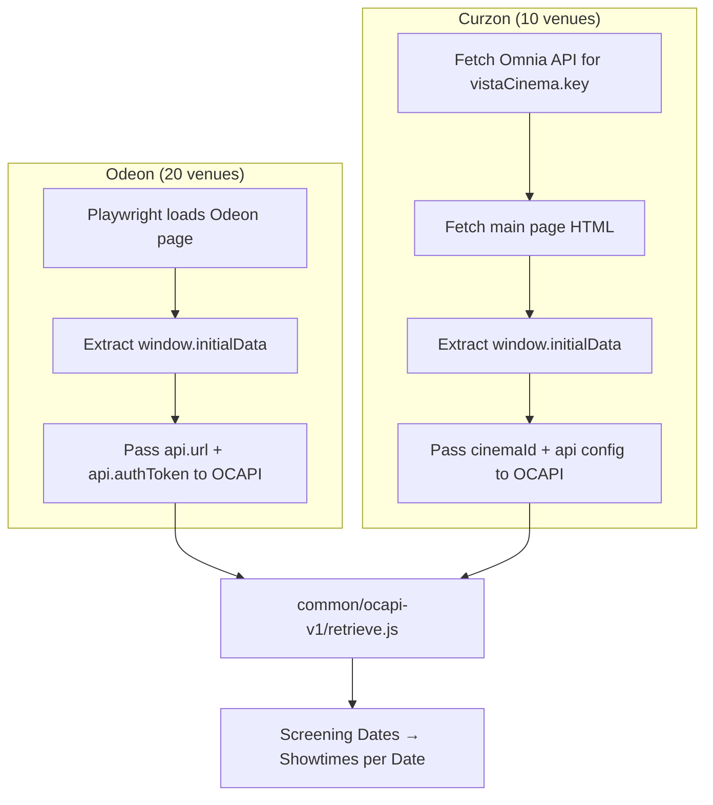
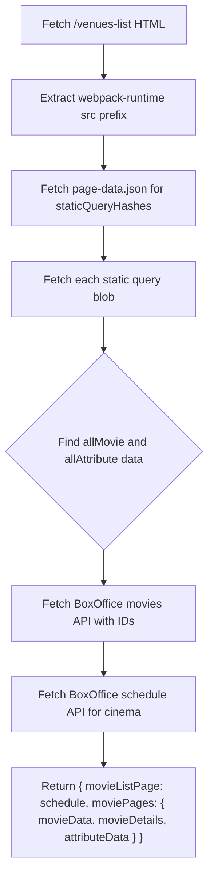

# Retrieve Pipeline

The retrieve pipeline is responsible for fetching raw cinema listing data from
websites and APIs. It produces the unprocessed data that the
[transform pipeline](./transform.md) later converts into a standardised format.

## Architecture

The retrieve step supports two kinds of modules:

- **Cinemas** -- individual venues (e.g. `odeon.co.uk-leicester-square`). Each
  has its own `retrieve.js`, `transform.js`, and `attributes.js`.
- **Sources** -- external ticketing platforms (e.g. Eventbrite, Dice.fm). These
  supply supplementary event data that cinemas can incorporate during transform.

### Dispatch Flow



The entry point (`scripts/retrieve/index.js`) resolves the location name to
either a cinema or source module, then calls its `retrieve()` function. The
returned data is opaque to the orchestrator -- each module defines its own
structure.

### The Delegation Pattern

Most cinemas don't implement retrieval from scratch. Instead, they delegate to a
shared platform module in `common/`, passing venue-specific attributes:

```
cinemas/odeon.co.uk-leicester-square/retrieve.js
  → common/odeon.co.uk/retrieve.js
    → common/ocapi-v1/retrieve.js
```

A typical cinema `retrieve.js` looks like this:

```js
// cinemas/odeon.co.uk-leicester-square/retrieve.js
const attributes = require("./attributes");
const odeonRetrieve = require("../../common/odeon.co.uk/retrieve");

async function retrieve() {
  return odeonRetrieve(attributes);
}
```

The `attributes.js` file provides venue-specific configuration:

```js
// cinemas/odeon.co.uk-leicester-square/attributes.js
module.exports = {
  id: "odeon.co.uk-leicester-square",
  name: "ODEON Luxe Leicester Square",
  domain: "https://www.odeon.co.uk",
  url: "https://www.odeon.co.uk/cinemas/london-leicester-square",
  cinemaId: "153",
  // ... address, geo, socials, etc.
};
```

Of the 145 cinemas with retrieve implementations, 112 delegate to one of 17
shared platforms in `common/`. The remaining ~33 have standalone
implementations.

---

## Finding the Data

Before choosing an approach below, work out where the listings actually live.
Follow the trail the site itself leaves; do not guess at URLs. Every step here
is cheap, and each one narrows what the next has to look for.

**1. Fetch the page and read what the server sent.**

```bash
curl -sSL -A "$UA" "https://example.com/whats-on" -o page.html
```

Look for JSON-LD (`application/ld+json`), an embedded state blob
(`__NEXT_DATA__`, `self.__next_f`, `wix-warmup-data`,
`type="application/json"`), and complete `<meta>` tags — Square Online, for one,
puts a listing's full description in `<meta name="description">` even though the
body is client-rendered. If the data is here, stop: no browser needed.

**2. Look for iframes.** A venue frequently embeds its ticketing platform rather
than hosting listings itself. `document.body.innerText` on the top frame does
**not** include iframe content, so a page can look empty while its whole
programme sits one frame down. Enumerate `page.frames()`, not just the document.

**3. Render it and watch the network.** If the body is client-rendered, open it
in Playwright and log every request and response, filtering out analytics. The
endpoint the page calls is the endpoint to use — it needs no guessing, and it is
usually reachable anonymously with a browser `User-Agent`.

```js
page.on("response", async (r) => {
  const url = r.url();
  if (/analytics|googletagmanager|facebook|frog\.wix/.test(url)) return;
  console.log(r.status(), r.request().method(), url);
});
```

Some widgets only fire their data request on interaction — clicking a date
picker, opening "Check availability" — so drive the page, don't just load it.

**4. Reuse the ids already in the HTML.** Client-rendered sites routinely ship
the ids their own API needs: `site_id`, `user`, `merchantId`, a Spektrix
`client-name`, an organisation slug. Grep the page for them before treating any
id as unknowable.

**5. Only then** consider `sitemap.xml`, a documented platform API, or the
platform's own docs. A sitemap is useful for discovery but is often stale —
Ognisko Polskie's lists 48 products where the live store shows 27.

**If the trail runs out, ask.** A site that visibly renders its programme is
very unlikely to be publishing incomplete data — far more often the request that
carries it hasn't been found yet. Say what was tried and what is missing rather
than concluding the venue can't be retrieved: that conclusion changes the
deliverable (see "Source-Only or Own Retriever?" in `adding-a-venue.md`) and is
the user's call, not an implementation detail.

---

## Retrieval Approaches

### Direct JSON Fetch

The simplest approach: a single `fetchJson()` call returns all needed data.

**Platforms:** Electric Cinema (2 venues)

```js
// common/electriccinema.co.uk/retrieve.js
async function retrieve({ domain }) {
  const site = await fetchJson(`${domain}/data/data.json`);
  return site;
}
```

### Single HTML Page

Fetches a single HTML page that contains all listing data. No detail page
requests are needed because the listing page has enough information for the
transform step.

**Platforms:** Firmdale Hotels (3 venues) **Sources:** Stow Film Lounge

```js
// common/firmdalehotels.com/retrieve.js
async function retrieve({ url }) {
  const movieListPage = await fetchText(url);
  return { movieListPage };
}
```

### HTML Scraping (List + Detail Pages)

The most common pattern for standalone cinemas. Fetches a listing page, parses
it with Cheerio to extract links, then fetches each detail page individually.

**Platforms:** Tate (2 venues), Olympic Studios (3 venues), The Castle Cinema (2
venues), Admit One (2 venues) **Standalone:** ~33 cinemas use this pattern with
venue-specific selectors **Sources:** OutSavvy, Wimbledon Film Club,
WeGotTickets

```js
// cinemas/ica.art/retrieve.js
async function retrieve() {
  const movieListPage = await fetchText(url);
  const $ = cheerio.load(movieListPage);

  const moviePageUrls = new Set();
  $(".item.films").each(function () {
    const url = $(this).children("a").attr("href");
    moviePageUrls.add(`${domain}${url}`);
  });

  const moviePages = {};
  for (const moviePageUrl of [...moviePageUrls]) {
    moviePages[moviePageUrl] = await fetchText(moviePageUrl);
  }

  return { movieListPage, moviePages };
}
```

Each venue uses different CSS selectors (`.item.films`, `.card-list .card a`,
`.programme-tile`, `.whatson_panel`, etc.) but the fetch-parse-fetch structure
is the same.

**Variant:** Admit One uses `fetchWin1252Text()` instead of `fetchText()` to
handle legacy Windows-1252 encoded pages.

### Embedded JSON Extraction

Fetches an HTML page and extracts structured data from embedded `<script>` tags
using regex or Cheerio. This avoids the need for a separate API call when the
page already embeds all data in JavaScript.

**Patterns:**

| Pattern                      | Used By                      |
| ---------------------------- | ---------------------------- |
| `var Events = {...}`         | Savoy Systems (4 venues)     |
| `window.initialData = {...}` | Odeon/Curzon (bootstrapping) |
| `#__NEXT_DATA__`             | Dice.fm (source)             |
| `window.__SERVER_DATA__`     | Eventbrite (source)          |

```js
// common/savoysystems.co.uk/retrieve.js
async function retrieve({ url }) {
  const page = await fetchText(url);
  const events = page.match(/<script>\s*var\s+Events\s+=\s+(.*)\s+<\/script>/i);
  const movieListPage = JSON.parse(events[1]);

  const moviePages = {};
  for (const movie of movieListPage.Events) {
    if (movie.URL) {
      moviePages[movie.ID] = await fetchText(movie.URL);
    }
  }

  return { movieListPage, moviePages };
}
```

For Dice.fm, the embedded JSON is in a Next.js `#__NEXT_DATA__` script tag,
parsed with Cheerio:

```js
const $ = cheerio.load(page);
const data = JSON.parse($("#__NEXT_DATA__").html());
return data.props.pageProps.events;
```

### Multi-Endpoint REST API

Fetches an index or date list, then iterates to fetch detailed data for each
date or item. This is typical of cinema chains with dedicated data APIs.

**Platforms:** Cineworld (12 venues), Picturehouse (11 venues)

```js
// common/cineworld.co.uk/retrieve.js (simplified)
async function retrieve({ cinemaId }) {
  const activeDates = await fetchJson(
    `${apiUrl}/quickbook/${tenantId}/dates/in-cinema/${cinemaId}/until/${untilDate}`,
  );

  const movieListPage = [];
  for (const activeDate of activeDates.body.dates) {
    const showingsOnDate = await fetchJson(
      `${apiUrl}/quickbook/${tenantId}/film-events/in-cinema/${cinemaId}/at-date/${activeDate}`,
    );
    movieListPage.push(showingsOnDate.body);
  }

  // Fetch additional film details by distributor code
  const moviePages = {};
  for (const filmId of filmIds) {
    moviePages[filmId] = await fetchJson(
      `${apiUrl}/${tenantId}/films/byDistributorCode/${filmId}`,
    );
  }

  return { movieListPage, moviePages };
}
```

Picturehouse uses a similar pattern but with a POST request to fetch the initial
movie list and HTML detail pages rather than JSON:

```js
// common/picturehouses.com/retrieve.js (simplified)
const moviesResponse = await fetch(`${domain}/api/get-movies-ajax`, {
  method: "POST",
  body: new URLSearchParams({
    start_date: "show_all_dates",
    cinema_id: cinemaId,
  }),
});
```

### OCAPI (Open Cinema API)

A standardised cinema industry REST API authenticated with Bearer tokens. The
retrieval flow fetches available screening dates, then iterates through each
date to get showtimes.

**Platforms:** Odeon (20 venues), Curzon (10 venues)

```js
// common/ocapi-v1/retrieve.js
async function retrieve({ cinemaId }, { url, apiUrl, authToken }) {
  const getHeaders = () => ({
    Accept: "application/json",
    authorization: `Bearer ${authToken}`,
  });

  const prefix = url || apiUrl;
  const { filmScreeningDates } = await fetch(
    `${prefix}/ocapi/v1/film-screening-dates?siteIds=${cinemaId}`,
    { headers: getHeaders() },
  ).then((r) => r.json());

  const moviePages = [];
  for (const { businessDate } of filmScreeningDates) {
    const showtimesData = await fetch(
      `${prefix}/ocapi/v1/showtimes/by-business-date/${businessDate}?siteIds=${cinemaId}`,
      { headers: getHeaders() },
    ).then((r) => r.json());
    moviePages.push(showtimesData);
  }

  return moviePages;
}
```

OCAPI itself is a generic implementation. Each chain wraps it with its own
strategy to obtain the API URL and auth token:



### GraphQL API

A single POST request with a GraphQL query and variables. The server returns a
comprehensive dataset including movies, showings, ratings, and TMDB data.

**Platform:** Indy Cinema Group (3 venues)

```js
// common/indycinemagroup.com/retrieve.js
const query = `
  query ($limit: Int, $orderBy: String, $type: String) {
    movies(limit: $limit, orderBy: $orderBy, type: $type) {
      data {
        id, name, urlSlug, synopsis, starring, directedBy,
        duration, genre, rating, trailerYoutubeId, tmdbId,
        showings { id, time, screenId, seatsRemaining, displayMetaData }
      }
    }
  }
`;

async function retrieve({ siteId, domain }) {
  const response = await fetch(`${domain}/graphql`, {
    method: "POST",
    body: JSON.stringify({
      query,
      variables: { limit: 1000, orderBy: "magic", type: "all-published" },
    }),
    headers: {
      "Content-Type": "application/json",
      "client-type": "consumer",
      cookie: `site_id=${siteId}`,
    },
  });
  return await response.json();
}
```

The `site_id` cookie determines which venue's data is returned, allowing the
same endpoint to serve multiple cinemas.

### Static Site Data Extraction (Gatsby)

Reconstructs data from a Gatsby-built site by extracting the webpack hash,
fetching static query blobs, then calling a BoxOffice API for schedule details.

**Platform:** Everyman Cinema (16 venues)



All Gatsby data fetches are wrapped in `dailyCache()` to avoid redundant
requests when processing multiple Everyman venues in the same run.

### Browser Automation (Playwright)

For JavaScript-rendered pages or when API credentials can only be obtained by
running the page in a browser. Uses the shared `get-page-with-playwright.js`
helper which provides:

- **Stealth plugin** -- avoids bot detection
- **Daily caching** -- results are cached to disk so Playwright only runs once
  per day per cache key
- **Error screenshots** -- saved to `playwright-failures/` on failure
- **90-second timeout** -- extended from default for slower runners

There are two sub-patterns:

#### Page Content Extraction

Launches a browser, waits for the page to render, and returns the full HTML.

**Platforms:** BFI (2 venues), Ticketek (1 venue) **Sources:** TicketSource,
Ticket Tailor, Ti.to

```js
// common/ticketek.co.uk/retrieve.js (simplified)
const movieListPage = await getPageWithPlaywright(
  url,
  cacheKey,
  async (page) => {
    await page.waitForLoadState();
    await page.locator("#contentShell").waitFor({ strict: false });
    return await page.content();
  },
);
```

BFI is the most complex Playwright implementation: it handles paginated search
results (clicking "next page" and waiting for URL changes), per-movie detail
page fetches with retry logic and 30-second delays, error page detection, and
known bad article ID filtering.

#### In-Browser API Calls

Launches a browser to establish a session, then executes `fetch()` from within
the page context to call APIs that require browser cookies or session state.

**Platforms:** MyVue (17 venues), Odeon (20 venues, for `window.initialData`)

```js
// common/myvue.com/retrieve.js
async function retrieve({ domain, url, cinemaId }) {
  return await getPageWithPlaywright(
    url,
    `myvue.com-${cinemaId}`,
    async (page) => {
      await page.waitForLoadState();
      await page.locator(".header__box").waitFor();
      return page.evaluate(
        (url) => fetch(url).then((response) => response.json()),
        `${domain}/api/microservice/showings/cinemas/${cinemaId}/films`,
      );
    },
  );
}
```

### Signed API Requests

API calls authenticated with HMAC-SHA256 signatures. The request body is sorted,
serialized, and signed with the API key concatenated with a Unix timestamp.

**Platform:** Cinesync (2 venues)

```js
// common/cinesync.io/utils.js (simplified)
function generateSignature(body, apiKey, timestamp) {
  const sortedBody = Object.keys(body).sort().reduce(/* ... */);
  const hmacKey = apiKey + timestamp;
  return crypto
    .createHmac("sha256", hmacKey)
    .update(JSON.stringify(sortedBody))
    .digest("hex");
}
```

The retrieval fetches available dates first, then performances for each date:

```js
// common/cinesync.io/retrieve.js (simplified)
const movieDatesPage = await fetchSignedJson(apiKey, apiUrl, datesQuery);
const movieListPage = [];
for (const date of movieDatesPage.data.dates) {
  movieListPage.push(
    await fetchSignedJson(apiKey, apiUrl, performancesQuery(date)),
  );
}
return { movieDatesPage, movieListPage };
```

### Source-Only (No Retrieval)

Some venues have no website to scrape. Their events come entirely from external
sources (Eventbrite, Dice, etc.) which are incorporated during the transform
step. Their retrieve function simply returns an empty object:

```js
async function retrieve() {
  return {};
}
```

---

## Shared Platforms

| Platform          | Venues | Approach                        | Key File                                  |
| ----------------- | ------ | ------------------------------- | ----------------------------------------- |
| Odeon (OCAPI)     | 20     | Playwright + OCAPI              | `common/odeon.co.uk/retrieve.js`          |
| MyVue             | 17     | Playwright + in-browser fetch   | `common/myvue.com/retrieve.js`            |
| Everyman          | 16     | Gatsby + BoxOffice API          | `common/everymancinema.com/retrieve.js`   |
| Cineworld         | 12     | Multi-endpoint REST API         | `common/cineworld.co.uk/retrieve.js`      |
| Picturehouse      | 11     | POST API + HTML detail pages    | `common/picturehouses.com/retrieve.js`    |
| Curzon (OCAPI)    | 10     | Omnia API + OCAPI               | `common/curzon.com/retrieve.js`           |
| Savoy Systems     | 4      | Embedded JSON extraction        | `common/savoysystems.co.uk/retrieve.js`   |
| Indy Cinema Group | 3      | GraphQL API                     | `common/indycinemagroup.com/retrieve.js`  |
| Firmdale Hotels   | 3      | Single HTML page                | `common/firmdalehotels.com/retrieve.js`   |
| Olympic Studios   | 3      | HTML list + detail pages        | `common/olympicstudios.com/retrieve.js`   |
| Electric Cinema   | 2      | Direct JSON file                | `common/electriccinema.co.uk/retrieve.js` |
| BFI               | 2      | Playwright pagination + details | `common/bfi.org.uk/retrieve.js`           |
| Tate              | 2      | HTML list + detail pages        | `common/tate.org.uk/retrieve.js`          |
| Cinesync          | 2      | Signed REST API                 | `common/cinesync.io/retrieve.js`          |
| The Castle Cinema | 2      | HTML list + detail pages        | `common/thecastlecinema.com/retrieve.js`  |
| Admit One         | 2      | HTML scraping (Win-1252)        | `common/admit-one.co.uk/retrieve.js`      |
| Ticketek          | 1      | Playwright + HTML parsing       | `common/ticketek.co.uk/retrieve.js`       |
| Standalone        | ~33    | Various (mostly HTML scraping)  | Per-cinema `cinemas/*/retrieve.js`        |

---

## Sources

Sources are external ticketing platforms that aren't cinemas themselves. They're
used in two ways:

1. **Direct retrieval** -- fetching event listings from the platform
2. **Event supplementation** -- during transform, cinema modules call each
   source's `findEvents()` to discover events at their venue that might not
   appear on their own website

| Source                  | Approach                                  | Key Detail                                                             |
| ----------------------- | ----------------------------------------- | ---------------------------------------------------------------------- |
| bbk.ac.uk               | HTML list + detail pages                  | Cheerio scraping, filtered by tag                                      |
| designmynight.com       | Paginated REST API + monthly availability | Deduplicates occurrences across months                                 |
| dice.fm                 | Embedded JSON (`#__NEXT_DATA__`) + pages  | Also searches theatre category for films                               |
| eventbrite.co.uk        | Embedded JSON (`__SERVER_DATA__`) + pages | Searches "screening" + "film-and-media"                                |
| feverup.com             | HTML list + detail pages + sessions API   | Fetches calendar dates then session times per plan/place/date          |
| freefilmfestivals.org   | HTML festival list + festival + events    | The Events Calendar pages; times and venue geo from schema.org JSON-LD |
| japanesefilm.club       | HTML list + detail pages + venue pages    | Venue pages fetched for postcodes, as names collide UK-wide            |
| outsavvy.com            | HTML list + detail pages                  | Cheerio scraping                                                       |
| stowfilmlounge.com      | Single HTML page                          | Simple `fetchText`                                                     |
| thecliq.app-            | GraphQL API                               | Queries clubs + events + batched event details                         |
| ti.to                   | Playwright list + detail pages            | Per-venue-slug retrieval                                               |
| ticketsource.co.uk      | Algolia search API + Playwright details   | Multiple search filters (geo, location, NT Live, Exhibition On Screen) |
| tickettailor.com        | Playwright per-venue-slug pages           | Hardcoded venue slugs list                                             |
| tufnellparkfilmclub.com | Single HTML page                          | Squarespace event list, Cheerio scraping                               |
| wegottickets.com        | Session-backed search + detail pages      | POST search held against a PHP session cookie; film and pop-up genres  |

---

## Common Utilities

### HTTP Fetching

All retrieval modules use shared fetch helpers from `common/utils.js`:

| Function           | Description                                  |
| ------------------ | -------------------------------------------- |
| `fetchText`        | Fetch URL, return response as text           |
| `fetchJson`        | Fetch URL, return parsed JSON                |
| `fetchWin1252Text` | Fetch URL, decode as Windows-1252 text       |
| `fetchWithRetry`   | Fetch with configurable retries and delay    |
| `withRetry`        | Generic retry wrapper for any async function |

### Playwright Helper

`common/get-page-with-playwright.js` wraps Playwright with:

- **`playwright-extra` stealth plugin** to avoid bot detection
- **90-second timeout** (extended from default for slower CI runners)
- **1280x720 viewport** for consistent rendering
- **Daily caching** via `dailyCache()` -- the browser is only launched if no
  cached result exists for the current day
- **Error screenshots** saved to `playwright-failures/` on failure

### Caching

`common/cache.js` provides file-based caching:

- **`dailyCache(key, fn)`** -- caches the result of `fn` to disk with a date
  suffix (`key-yyyy-MM-dd`). Subsequent calls on the same day return the cached
  result without executing `fn`.
- Cache files are stored in a `cache/` directory at the project root.
- Used by Playwright operations, Gatsby blob fetches, and other expensive
  retrievals to avoid redundant network requests when processing multiple
  venues.

---

## Return Data Structures

Retrieve functions return raw data in module-specific formats. The most common
structure is:

```js
{
  movieListPage, moviePages;
}
```

Where `movieListPage` is the listing data (HTML string, JSON object, or array)
and `moviePages` is a dictionary keyed by URL or ID containing detail page data.

Notable variants:

| Return Shape                                                                | Used By                            |
| --------------------------------------------------------------------------- | ---------------------------------- |
| `{ movieListPage, moviePages }`                                             | Most cinemas and sources           |
| `moviePages` (plain array)                                                  | OCAPI (Odeon, Curzon)              |
| `site` (plain object)                                                       | Electric Cinema                    |
| `{ movieDatesPage, movieListPage }`                                         | Cinesync                           |
| `{ movieListPage, moviePages: { movieData, movieDetails, attributeData } }` | Everyman                           |
| `{ movieListPages, moviePages }`                                            | Dice.fm, DesignMyNight, Eventbrite |
| `{ clubPages }`                                                             | Ticket Tailor                      |
| `{ venues: { [slug]: { movieListPage, moviePages } } }`                     | Ti.to                              |
| `{}`                                                                        | Source-only venues                 |
