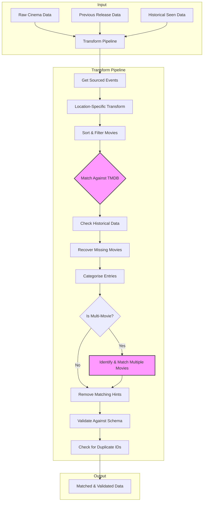
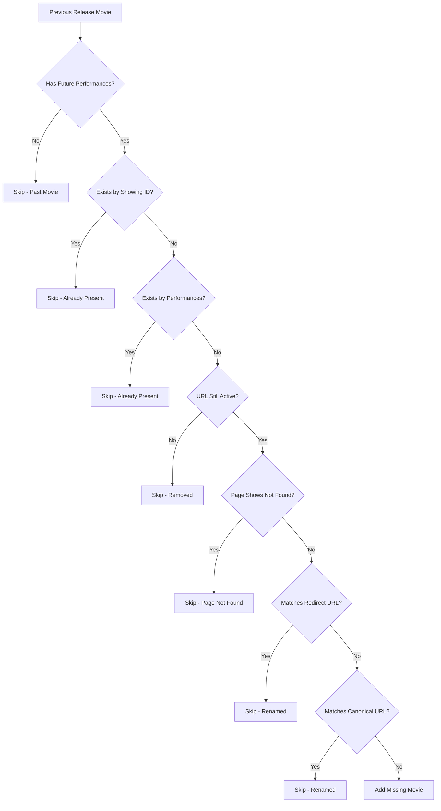
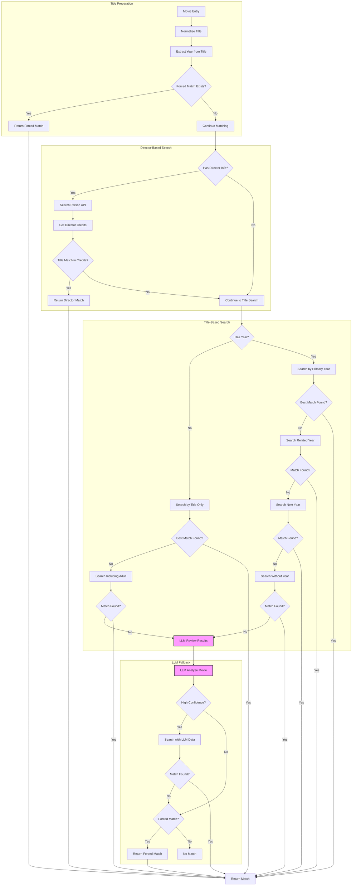
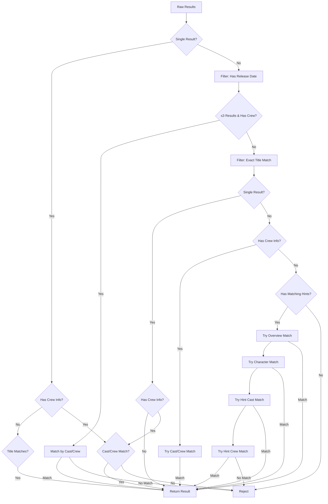

# Transform Pipeline

The transform pipeline is responsible for converting raw cinema listing data
into a standardized, enriched format. It takes scraped data from cinema websites
and produces validated, matched movie entries ready for consumption.

## Overview

The transform process runs for each cinema location and performs the following
high-level steps:

1. **Source External Events** - Gather supplementary event data from external
   ticketing platforms
2. **Transform Raw Data** - Convert location-specific raw data into standardized
   format
3. **Match Against The Movie DB** - Enrich entries with metadata from The Movie
   Database (TMDB)
4. **Check Historical Data** - Track when movies were first seen and recover
   missing entries
5. **Categorise Entries** - Use LLM to classify entries (movie, TV, quiz, etc.)
6. **Process Multi-Movie Events** - Handle double bills, marathons, and
   trilogies
7. **Validate Output** - Ensure data conforms to the JSON schema

## Flow Diagram



## Pipeline Stages

### 1. Get Sourced Events

Before transforming cinema data, the pipeline gathers supplementary event data
from external ticketing platforms. This includes:

- **DesignMyNight** - Event booking platform
- **Dice.fm** - Event ticketing
- **Eventbrite** - Event management
- **OutSavvy** - Independent event ticketing
- **TicketSource** - Box office services
- **TicketTailor** - Event ticketing

Each source's `findEvents` function is called with the cinema's attributes
(coordinates, name, etc.) to find matching events that can supplement the main
cinema data.

### 2. Location-Specific Transform

Each cinema location has its own transform module that knows how to parse its
specific data format. The transform function:

- Parses raw HTML/JSON from the cinema's website
- Extracts movie titles, showtimes, booking URLs
- Normalizes the data into the standard schema
- May incorporate sourced events data
- Returns an array of movie objects

The result is sorted and filtered to remove duplicates and invalid entries.

### 3. Match Against The Movie DB

This is the most complex stage and is
[documented separately below](#the-movie-db-matching).

Each movie is matched against The Movie Database (TMDB) API to enrich it with:

- TMDB ID for cross-referencing
- Official title
- Release date
- Plot summary
- Runtime (if not already present)

### 4. Check Historical Data

The pipeline tracks when each movie listing was first seen:

- **Previously seen movies** - Preserve the original `seen` timestamp
- **New movies** - Set `seen` to the current timestamp

This allows tracking of how long a movie has been listed, even if it temporarily
disappears and reappears.

### 5. Recover Missing Movies

For opted-in locations, the pipeline checks if any movies from the previous
release are missing:



This prevents movies from being dropped when:

- A cinema temporarily removes a listing
- Technical issues cause scraping failures
- Movies are renamed or URLs change

### 6. Categorise Entries

Movies without a TMDB match are categorized using an LLM. Categories include:

| Category          | Description                        |
| ----------------- | ---------------------------------- |
| `movie`           | Single full-length film screening  |
| `multiple-movies` | Double bills, marathons, trilogies |
| `tv`              | TV show episode screenings         |
| `shorts`          | Programme of short films           |
| `quiz`            | Quiz events                        |
| `comedy`          | Stand-up, open mic                 |
| `music`           | Concerts, album playbacks          |
| `talk`            | Discussions, panels                |
| `workshop`        | Workshop events                    |
| `event`           | Catch-all for uncategorized        |

The LLM analyzes the title and description to determine the category with a
confidence score.

### 7. Process Multi-Movie Events

For events categorized as `multiple-movies`, the pipeline:

1. Uses LLM to identify individual films from the event description
2. Filters to high-confidence identifications (≥7)
3. Matches each identified film against TMDB
4. Stores results in `themoviedbs` array (plural)

### 8. Validate Output

Final validation ensures:

- Data conforms to the JSON schema (using AJV)
- No duplicate `showingId` values exist

---

## The Movie DB Matching

The TMDB matching process is sophisticated, with multiple strategies to find the
correct match while avoiding false positives.

### Matching Flow Diagram



### Title Normalization

Before matching, titles undergo extensive normalization. The normalization
process includes:

1. **Whitespace normalization** - Remove non-breaking spaces, collapse multiple
   spaces
2. **Theatre performance standardization** - Handle "NT Live:", "Met Opera:",
   etc.
3. **Specific corrections** - Fix common misspellings and venue-specific quirks
4. **Prefix removal** - Strip "X presents:", "X selects:", etc.
5. **Suffix removal** - Strip Q&A mentions, screening types, dates
6. **Format removal** - Remove "3D", "IMAX", "Dubbed", etc.
7. **Diacritics removal** - Normalize Unicode characters
8. **Special character removal** - Remove emoji, punctuation, symbols

Examples of corrections:

| Input                           | Output                                                                 |
| ------------------------------- | ---------------------------------------------------------------------- |
| `Terminator 2 Live`             | `Terminator 2 Judgment Day`                                            |
| `Dr. Strangelove`               | `Dr. Strangelove or: How I Learned to Stop Worrying and Love the Bomb` |
| `LOTR: The Two Towers`          | `The Lord of the Rings: The Two Towers`                                |
| `W&G: Curse Of The Were-Rabbit` | `Wallace & Gromit: The Curse Of The Were-Rabbit`                       |

### Matching Strategies

#### 1. Forced Matches

Some single-word or ambiguous titles are forced to specific TMDB IDs. This
handles cases where cinemas list movies with minimal information (e.g., just
"Elf" or "Notebook") that would otherwise fail to match or match incorrectly.
The forced matches map normalized titles to their known TMDB IDs.

#### 2. Director-Based Matching

If director information is available:

1. Search TMDB Person API for the director
2. Get their directing credits
3. Find a title match in their filmography

This is highly reliable for unique director-title combinations.

#### 3. Best Match Selection

When multiple TMDB results are returned, the `getBestMatch` function applies
filtering:



#### 4. Cast/Crew Verification

For ambiguous matches, the system fetches full movie details from TMDB and
compares the cast and crew against any known information from the cinema
listing. Director names are checked against crew credits, and actor names are
checked against cast credits. Names are normalized and compared with fuzzy
matching to handle variations (e.g., "Scott McGhee" vs "Scott McGehee"). A match
on any director or actor is sufficient to confirm the result.

#### 5. Matching Hints

Some transforms provide additional hints to aid matching:

- **overview** - Synopsis text to compare with TMDB overview
- **characters** - Character names mentioned in description
- **cast** - Possible cast names extracted from synopsis
- **crew** - Director or other crew names
- **year** - Release year if known

#### 6. LLM-Assisted Matching

When traditional matching fails, an LLM analyzes the listing:

1. **Review Results** - Ask LLM to pick the best match from TMDB results
2. **Identify Movie** - Ask LLM to identify the movie and provide additional
   data

The LLM can extract:

- Corrected movie title
- Release year
- Director/cast names
- Whether it's actually a movie (vs event, TV, etc.)

### Ignored TMDB IDs

Certain TMDB entries are explicitly ignored due to quality issues, including
low-quality entries, duplicates pending deletion, or entries with generic titles
that cause frequent mismatches (e.g., entries titled "Screening" or "Film
Festival"). These IDs are filtered out of all search results before matching is
attempted.

### Caching

All TMDB API responses are cached daily to:

- Reduce API calls
- Speed up repeat runs
- Handle API rate limits gracefully

---

## Error Handling

Each stage wraps operations in try-catch blocks and logs progress. The pipeline
outputs emoji-prefixed status messages showing success (✅) or failure (❌) for
each stage, along with timing and match statistics (e.g., "Matched 45/50 in
12s").

This provides:

- Clear progress indicators
- Timing information
- Match success rates
- Graceful error propagation

---

## Data Flow Example

Raw HTML/JSON scraped from a cinema website:

```json
{
  "filmTitle": "LOTR: The Two Towers (Extended) [12A]",
  "synopsis": "Peter Jackson's epic sequel. Frodo and Sam continue...",
  "runtime": "179 mins",
  "times": [
    { "date": "2026-02-10", "time": "19:00", "bookNow": "/book/abc123" }
  ]
}
```

After location-specific transform (standardized structure):

```json
{
  "title": "LOTR: The Two Towers (Extended)",
  "showingId": "example-cinema-lotr-extended",
  "url": "https://example-cinema.com/films/lotr-two-towers",
  "performances": [
    {
      "time": 1739217600000,
      "bookingUrl": "https://example-cinema.com/book/abc123"
    }
  ],
  "overview": {
    "directors": [],
    "actors": [],
    "year": null,
    "duration": 10740000,
    "classification": "12A"
  },
  "matchingHints": {
    "overview": "Peter Jackson's epic sequel. Frodo and Sam continue..."
  }
}
```

After full transform pipeline (matched and enriched):

```json
{
  "title": "LOTR: The Two Towers (Extended)",
  "showingId": "example-cinema-lotr-extended",
  "url": "https://example-cinema.com/films/lotr-two-towers",
  "performances": [
    {
      "time": 1739217600000,
      "bookingUrl": "https://example-cinema.com/book/abc123"
    }
  ],
  "overview": {
    "directors": [],
    "actors": [],
    "year": null,
    "duration": 10740000,
    "classification": "12A"
  },
  "themoviedb": {
    "id": 121,
    "title": "The Lord of the Rings: The Two Towers",
    "releaseDate": "2002-12-18",
    "summary": "Frodo and Sam are trekking to Mordor to destroy the One Ring..."
  },
  "category": "movie",
  "seen": 1738540800000
}
```

Note that `matchingHints` is removed from the final output after matching is
complete, as it's only used internally during the matching process.
